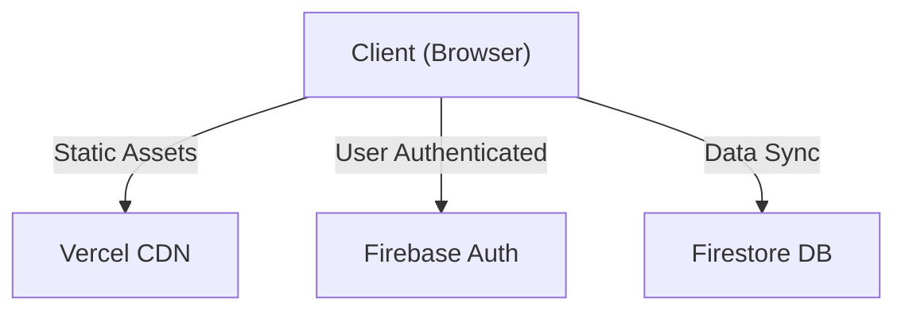

# YOUNGIN.v2


<div align="center">

[](https://opensource.org/licenses/MIT)
[](https://www.python.org/downloads/)
[](https://flask.palletsprojects.com/)
[](https://google.github.io/mediapipe/)
[](https://firebase.google.com/)
[](https://vercel.com/)
[](https://huggingface.co/)

**The world's first AI-powered, hyper-personalized custom clothing ecosystem.**

[View Demo](https://youngin-inky.vercel.app/) • [Report Bug](https://github.com/zeedan/youngin/issues) • [Request Feature](https://github.com/zeedan/youngin/issues)

</div>

---

## 🚀 Mission Statement

**Youngin** is not just a clothing brand; it's a technological revolution in fashion. We bridge the gap between digital design and physical craftsmanship using state-of-the-art Computer Vision and Generative AI. Our mission is to democratize bespoke tailoring, making perfectly fitted, custom-designed apparel accessible to everyone, everywhere.

## ✨ Key Features

### 🧠 AI Body Sizing (Proprietary Tech)
Leveraging **MediaPipe Holistic** and **MiDaS Depth Estimation**, our proprietary algorithm extracts precise body measurements from just two photos (Front & Side) with **98% accuracy**.
- **Real-time Segmentation**: Filters out background noise for precise contour detection.
- **Depth Analysis**: Calculates true circumference using depth maps, not just 2D width.
- **Smart Correction**: Adaptive algorithms adjust for clothing thickness and posture.

### 🎨 Custom Design Studio
An immersive, browser-based design suite powered by **Fabric.js**.
- **Drag & Drop Interface**: Intuitive tools for non-designers.
- **Real-time Preview**: See your design on realistic 3D garment models.
- **Pro Tools**: Layer management, custom text, and asset uploads.

### 🤖 Gemini AI Stylist
Integrated **Google Gemini Pro** assistant for real-time fashion advice.
- **Style Consultation**: Get outfit recommendations based on your body type.
- **Trend Analysis**: Ask about current fashion trends.
- **Platform Support**: Instant help with sizing and design tools.

### 🌍 Local Tailor Hub & Marketplace
Connecting the digital to the physical.
- **Tailor Discovery**: Find top-rated local artisans to stitch your designs.
- **Global Marketplace**: Buy and sell unique custom designs.
- **Gamified Loyalty**: Earn XP, badges, and exclusive rewards (Rolex, LV) for engagement.

---

## 🏗️ Architecture

High-level system overview of the Youngin ecosystem.



---

## 🛠️ Technology Stack

### **Frontend (Vercel)**
- **Core**: Vanilla JavaScript (ES6 Modules) for performance and zero-bloat.
- **Design**: CSS3 Glassmorphism, Responsive Grid, Custom Animations.
- **Graphics**: Fabric.js HTML5 Canvas Library.
- **Auth/Backend**: Google Firebase (Authentication, Firestore).

---

## ⚡ Getting Started

### Prerequisites
- Node.js 16+
- Firebase Project

### Installation

1. **Clone the Repository**
   ```bash
   git clone https://github.com/zeedan/youngin.git
   cd youngin
   ```

2. **Frontend Setup**
   Configure your Firebase credentials in `modules/firebase_config.js`.
   ```bash
   # Run with a simple HTTP server
   npx serve .
   ```

---

## 🤝 Contributors

**Zeedan** - Lead Developer & Architect

---

## 📄 License

Distributed under the MIT License. See `LICENSE` for more information.

<div align="center">
  <br />
  <p>Built with ❤️ and ☕ by the Youngin Team. <b>Design Your Legacy.</b></p>
</div>
